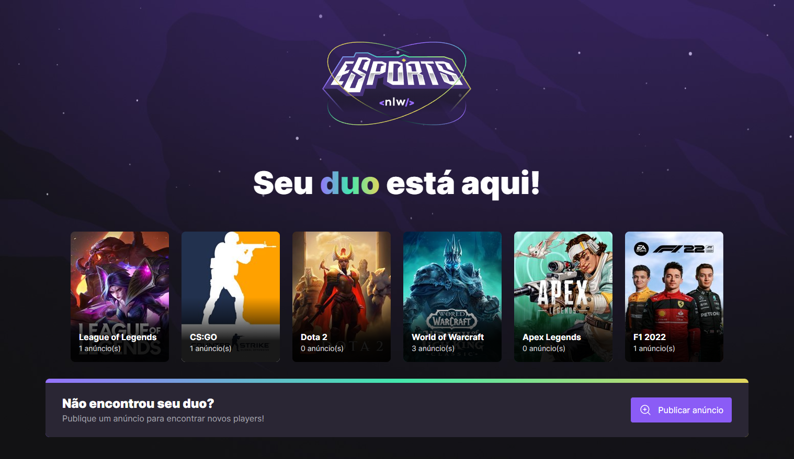

# NLW E-Sports - Ignite 
Trilha Ignite da Next Level Week E-Sports da Rocketseat, realizada em Setembro/2022, cujo objetivo era o desenvolvimento de um servidor com banco de dados (/server/), e aplicações React (/web/) e React-Native (/mobile/) para que usuários pudessem ver e criar anúncios para encontrar duos para jogar.

## Server
Server criado com Node, Express e Prisma, a ser usado tanto nas aplicações web como mobile.

## Web
Aplicativo web com funcionalidade de criar anúncios de 'Procurando Duo' criado com React

## Mobile
Aplicativo mobile com funcionalidade de ver os anúncios criados e copiar o discord do anunciante.

# Teconologias 🛠️
- ReactJs
- React Native
- Express
- Prisma
- NodeJs
- Git e Github

# Trilha Explorer 

<a href="https://github.com/Enyus/nlwesportsexplorer">Veja aqui o repositório da Trilha Explorer!</a>